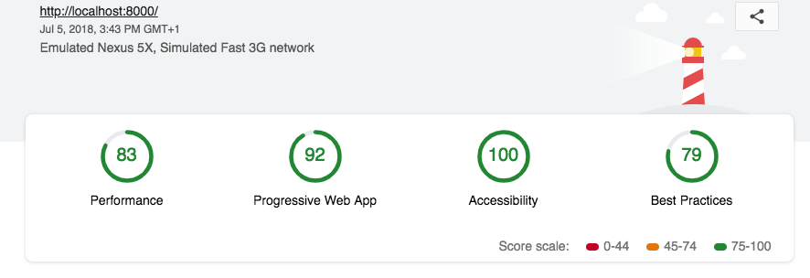

# Mobile Web Specialist Certification Course
---
#### _Three Stage Course Material Project - Restaurant Reviews_

## Project Overview: Stage 2

For the **Restaurant Reviews** project, we were asked to convert a static webpage to a mobile-ready web application, in three distinct stages.

### Stage 1

**Stage 1** focuses on responsive design, accessibility and the first steps of an offline-first approach:

- [x] all page elements are visible and usable in any screen size, including desktop, tablet and mobile
- [x] images do not overlap and adjust their size and quality to the device screen
- [x] images have descriptive `alt` attributes when needed
- [x] screen reader attributes are used when appropriate
- [x] semantic HTML5 markup or - when more appropriate - aria attributes are used
- [x] data is cached using a service worker and the Cache API so that any page already visited can be accessed offline

### Stage 2

**Stage Two** makes use of the Fetch API to fetch data from an external server (see below for details on this) and further builds on the project's offline-first capabilities, implementing more robust caching using the IndexedDB API to cache JSON responses, using an app shell architecture. Development for this stage of the project follows advised performance requirements relating to performance, Progressive Web Applications and accessibility:

- [x] the application fetches JSON restaurant data from a development server using the Fetch API, which it then parses to render in the UI
- [x] JSON responses are cached using the IndexedDB API, as part of our offline-first strategy
- [x] Lighthouse reports scores of 70+ in Performance and 90+ in Progressive Web Apps and Accessibility

## Working on the project

Because Stage 2 uses a development server (instead of simply sourcing restaurant data locally), we will need to run two separate servers in parallel.

### Connect to the development server

1. Fork and clone the [development server repository](https://github.com/udacity/mws-restaurant-stage-2) and follow the instructions on the repository to set it up on your local machine.

2. Once it's been installed, simply run `node server` in the command line to spin up the development server (by default, on port 1337).

### Build and serve with Gulp

> This project uses Gulp to automate various development tasks, generating responsive images, optimizing scripts and stylesheets and watching files for changes to serve during development.
>
> See the documentation at the top of the Gulpfile for a complete list of the tasks implemented and the Gulp modules they use.

3. To build and spin up a server that watches your files for changes simply run `gulp` from the project directory.

#### Favicons
> *This feature is not currently active and Web Manifest and app icons are included in the source directory to be built onto distribution through the `gulp` or `gulp build` tasks*

Gulp is used to generate, inject and update Favicons (using [Real Favicon Generator](https://realfavicongenerator.net/)). The build task includes a task to generate Favicons from scratch, but you should also run `gulp update:favicon` regularly to check Real Favicon Generator for updates.

## Note on ES6

Most of the code in this project has been written to the ES6 JavaScript specification for compatibility with modern web browsers and future proofing JavaScript code. Babel (through the Browserify transform Babelify) is also configured to transpile ES6 code into ES5 to ensure greater browser support. As much as possible, try to maintain use of ES6 in any additional JavaScript you write.
